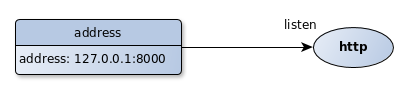
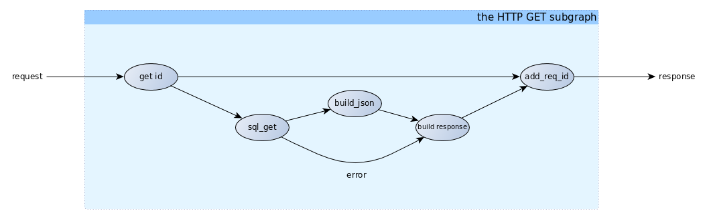
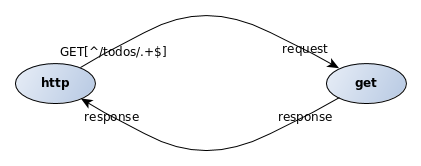
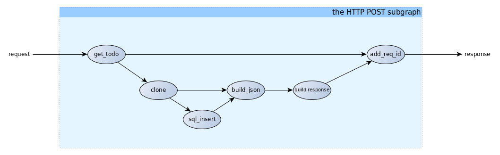
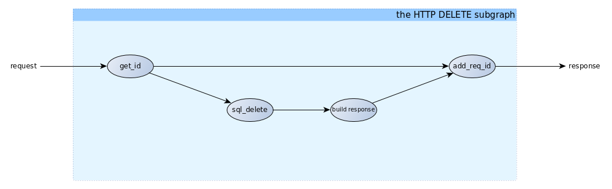
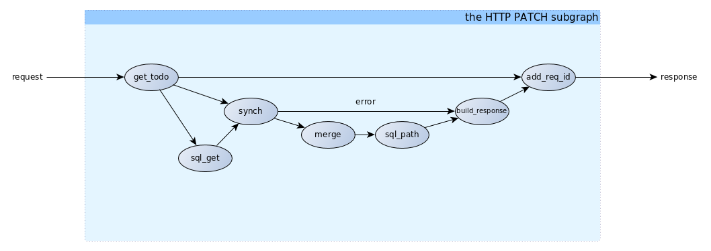
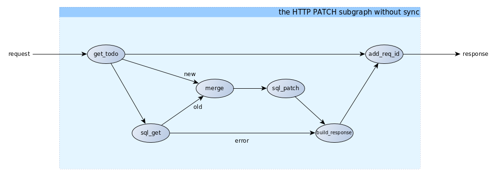
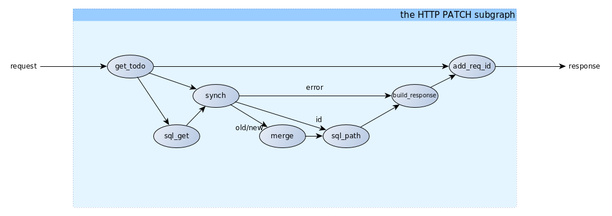

# HOWTO

## Intended Audience

People interesting in programming Fractalide applications.

## Purpose

To provide a step-by-step indepth example with links to source code on how to program Fractalide applications.
We'll be building a simple backend for a Todo app.

## Prerequisites

The reader should have read these documents:

1. [Nodes](./nodes/README.md)
2. [Edges](./edges/README.md)
3. [Fractals](./fractals/README.md)
4. [Services](./services/README.md)

## Steps

### Fractalide installation

#### Virtualbox guest installation

* Complete the [Installing Virtualbox Guest](http://nixos.org/nixos/manual/index.html#sec-instaling-virtualbox-guest) section of the NixOS Manual.

#### Building the `Fractalide Virtual Machine (FVM)``

Once logged into your virtualbox guest issue these commands:

* `$ git clone https://github.com/fractalide/fractalide.git`
* `$ cd fractalide`
* `$ nix-build`

Let us inspect the content of the newly created symlink called `result`.

```
$ readlink result
/nix/store/ymfqavzrgmj3q3aljgwvh769fq9dszp2-fvm
```
```
$ tree result
result
└── bin
    └── fvm
```
```
$ file result/bin/fvm
result/bin/fvm: ELF 64-bit LSB shared object, x86-64, version 1 (SYSV), dynamically linked, interpreter /nix/store/8lbpq1vmajrbnc96xhv84r87fa4wvfds-glibc-2.24/lib/ld-linux-x86-64.so.2, for GNU/Linux 2.6.32, not stripped
```

#### Peek under the hood

You shouldn't need to care too much about this during your everyday programming, but it's pleasant deviation from most normal workflows and thus should be explained.

Let's build a `subgraph` that runs a contrived `maths_boolean_nand` `agent`.

* `$ nix-build --argstr node test_nand`

This replaces the `result` symlink with a new symlink pointing to a generated file.
```
$ readlink result
/nix/store/zld4d7zc80wh38qhn00jqgc6lybd2cdi-test_nand
```
Let's investigate the contents of this executable file.
```
$ cat result
/nix/store/ymfqavzrgmj3q3aljgwvh769fq9dszp2-fvm/bin/fvm /nix/store/jk5ibldrvi6cai5aj1j00p8rgi3zw4l7-test_nand
```
Notice that we're passing the path of the actual `test_nand` `subgraph` into the `fvm`.

What does the contents of the actual `/nix/store/jk5ibldrvi6cai5aj1j00p8rgi3zw4l7-test_nand` file look like (the argument to `fvm`)?
```
$ cat /nix/store/jk5ibldrvi6cai5aj1j00p8rgi3zw4l7-test_nand/lib/lib.subgraph
'/nix/store/ynm9ipggdvxhzi5l2kkz9cgiqgvq2g87-prim_bool:(bool=true)' -> a nand(/nix/store/y919fp98qw33w0cs2wn5wzwgwpwgbchs-maths_boolean_nand) output -> input io_print(/nix/store/4fnk9dmky6jni4f4sbrzl1xsj50m3mb0-maths_boolean_print)
'/nix/store/ynm9ipggdvxhzi5l2kkz9cgiqgvq2g87-prim_bool:(bool=true)' -> b nand()
```
```
$ file /nix/store/jk5ibldrvi6cai5aj1j00p8rgi3zw4l7-test_nand/lib/lib.subgraph
/nix/store/jk5ibldrvi6cai5aj1j00p8rgi3zw4l7-test_nand/lib/lib.subgraph: ASCII text
```

The `--argstr node xxx` are arguments passed into the `nix-build` executable. Specifically

```
$ man nix-build
...
       --argstr name value
           This option is like --arg, only the value is not a Nix expression but a string. So instead
           of --arg system \"i686-linux\" (the outer quotes are to keep the shell happy) you can say
           --argstr system i686-linux.
...
```

The name `node` refers to the top level `graph` to be executed by the `fvm`. `nix` compiles each of the `agents` and inserts their paths into `subgraphs`. The `fvm` knows how how to recursively load the entire hierarchy of `subgraphs` which contain fully qualified paths to their composed `agents`.

#### A Todo backend

We will design an http server, that will host `todo` element. It will provide the following HTTP features : GET, POST, PATCH/PUT, DELETE. The different `todos` themselves will be saved in a `sqlite` database. The client will use `json` to deal with the `todos`.

A `todo` had the following fields :
* id : a unique integer id, that is used to retrieve, delete and patch the todos.
* title : a string that represents the goal of the todo, the text to display.
* completed : a boolean to remember if the todo has been completed.
* order : a positive integer used to display the todos in a certain order.

The http server responds to these requests :
* GET
The request will look like `GET http://localhost:8000/todos/1`. With the http method "GET", and a numeric ID given, the server will respond the corresponding todo in the database, otherwise it will respond a 404 page.
* POST
The request will look like `POST http://localhost:8000/todos`. The content of the request must be a `json` that correspond to a "todo". The `id` field is ignored. ex : `{ "title": "Create a todo http server", "order": 1 }`
* PATCH or PUT
The request will look like `PUT http://localhost:8000/todos/1`. The content of the request is the fields to update. ex : `{ "completed": true }`
* Delete
The request will be `DELETE http://localhost:8000/todos/1`. This will delete the todo with the `id` 1.

#### The Big Picture


The main `agent` here is `http` and will receive from the users and dispatch them to four other `subgraphs`, one for each HTTP feature. Each `subgraph` processes the request and provide a response. Before we approach the HTTP feature `subgraphs` let's take a look at the `http agent`.

##### The HTTP Agent

The implementation code can be found [here](https://github.com/fractalide/fractal_net_http/tree/master/nodes/http).

The `http agent` is a tiny http server. It receives http requests, asks for responses, then replies to the user.


The `http agent` has one [array output port](https://github.com/fractalide/fractal_net_http/blob/master/nodes/http/lib.rs#L57-L65) for each [HTTP method](https://docs.rs/tiny_http/0.5.5/tiny_http/enum.Method.html), and the `selection`/`elements` of each array output port is actually an insanely fast [rust regex](https://doc.rust-lang.org/regex/regex/index.html).

For example, `http() GET[^/news/?$]` will match the request with method GET and url `http://.../news` or `http://../news/`.

On the output port, it send an `Msg` with the schema [request](https://github.com/fractalide/fractal_net_http/blob/master/edges/request/default.nix). For here, we will just use the fields `id`, `url`, `content`. The `id` is the unique id for the request. It must be provided in the response corresponding to this request. The `url` is the url given by the user. The `content` is the content of the request, the data given by the user.

The `http agent` wants a `Msg` with the schema [response](https://github.com/fractalide/fractal_net_http/blob/master/edges/response/default.nix). A `response` has an `id`, which correspond to the `request id`. It also has a `status_code`, which is the response code of the request. By default, it's 200 (OK). The `content` is the data that are send back to the user.

The `http agent` must be started with an `iMsg` of type [address](https://github.com/fractalide/fractal_net_http/blob/master/edges/address/default.nix). It specifies on which address and port the server listens:



##### The GET Subgraph



``` nix
{ subgraph, nodes, edges }:

subgraph {
  src = ./.;
  flowscript = with nodes; with edges; ''
    db_path => db_path get_sql()
    input => input id(${todo_get_id}) id -> get get_sql(${sqlite_local_get})
    get_sql() id -> id todo_build_json(${todo_build_json})
    get_sql() response -> todo todo_build_json()
    id() req_id -> id todo_add_req_id(${todo_add_req_id})
    todo_build_json() json -> playload build_resp(${todo_build_response})
    get_sql() error -> error build_resp()
    build_resp() response -> response todo_add_req_id() response => response
   '';
}
```
[source for the get implemenation](https://github.com/fractalide/fractal_app_todo/blob/master/nodes/todo/get/default.nix)

A request will follow this path :
* Enters the `subgraph` via the virtual port `request`
* Then enters the `agent` `get_id`. This `agent` has two output ports : `req_id` and `id`. The `req_id` is the id of the http request, given by the `http` `agent`. The `id` is `todo id` retrieved from the url (ie: given the url http://.../todos/2, the number 2 will be sent over the `id` port).
* The url `id` enters the `sql_get` `agent`, that retrieve a `Msg` from a database corresponding to the `id`.
* If the `id` exists, the `Msg` is send to `build_json` that sends the json of the todo.
* If the `id` doesn't exist in the database, a `Msg` is send on the error port.
* The `build_request` will receive one `Msg` in one of its two input ports (`error` or `playload`). If there is an error, it will send a `404` response, or otherwise, it will send a `200` repsonse with the json as data.
* This new response now goes into the `add_req_id` `agent`, which retrieves the `req_id` from the request, and sets it in the new `response`.
* The response now leaves the `subgraph`.

Now we can connect the `http` `agent` to the `get` `subgraph`, to retrieve all the `GET` http request.



    http() GET[^/todos/.+$] -> request get()
    get() response -> response http()

Please understand how the code maps to the above diagram, as these particular diagrams shall not be repeated.


##### The POST Subgraph



``` nix
{ subgraph, nodes, edges }:

subgraph {
  src = ./.;
  flowscript = with nodes; with edges; ''
    db_path => db_path insert_todo()
    input => input todo_get_todo(${todo_get_todo}) todo -> input cl_todo(${msg_clone})
    cl_todo() clone[0] -> insert insert_todo(${sqlite_local_insert})
    cl_todo() clone[1] -> todo todo_build_json(${todo_build_json})
    insert_todo() response -> id todo_build_json()
    todo_get_todo() req_id -> id todo_add_req_id(${todo_add_req_id})
    todo_build_json() json -> playload todo_build_response(${todo_build_response})
    todo_build_response() response -> response todo_add_req_id() response => response
   '';
}
```

[source for the post implementation](https://github.com/fractalide/fractal_app_todo/blob/master/nodes/todo/post/default.nix)


A request will follow this path :
* Enters the `subgraph` by the virtual port `request`
* Enters the `agent``get_todo`. `get_todo` sends `req_id` and the content, which is converted from `json` into a new schema [todo](https://github.com/fractalide/fractal_app_todo/blob/master/edges/todo/default.nix).
* The `todo` schema is then cloned and sent to two `agents`.
* One clone goes to `sql_insert`, which sends out the url `id` of the todo found in the database. This id is send in `build_json`.
* The `build_json` receives the database id and the todo, and merges them together in `json` format.
* This approach allows the building of a response with json as the content.
* `add_req_id` then add the `req_id` in the reponse
* The response is sent out

The post `subgraph` is connect to the `http` output port :

    http() POST[/todos/?$] -> request post()
    post() response -> response http()

##### The DELETE Subgraph



``` nix
{ subgraph, nodes, edges }:

subgraph {
  src = ./.;
  flowscript = with nodes; with edges; ''
    input => input id(${todo_get_id})
    db_path => db_path delete_sql()
    id() id -> delete delete_sql(${sqlite_local_delete})
    delete_sql() response -> playload build_resp(${todo_build_response})
    id() req_id -> id todo_add_req_id(${todo_add_req_id})
    build_resp() response -> response todo_add_req_id() response => response
   '';
}
```
[source for the delete implementation](https://github.com/fractalide/fractal_app_todo/blob/master/nodes/todo/delete/default.nix),

This `subgraph` is easier than the two before, so it is mainly self-explaining!

* The `req_id` and the `id` are get in `get_id`.
* The `id` is send to `sql_delete`, which give back the id to `build_response`.
* `build_response` simply fill the http response with the id
* `add_req_id` add the http `id`

The delete `subgraph` is connect to the `http` output port :

    http() DELETE[/todos/.+] -> request delete()
    delete() response -> response http()


##### The PATCH Subgraph



The patch `subgraph` is a little more complicated, because of the `synch` `agent`. Let first see what happend without it :



The "idea" of the stream is :
* Get the new "todos" values in the request
* In parrallel, get the old value of the todo (look in the database)
* Then, send the old and the new values to a "merge" `agent`, that build the result todo

The problem with this simple flow is when the "old" todo doesn't exist, when the "old" todo is not in the database. In this case, the "old" edge (from `get_todo` to `merge`) and the "error" edge (from `sql_get` to `build_response`) are completly concurent. There will be a problem in the case of the "error" case. If the "todo" is not found in the database, `sql_get` will send an error. But `get_todo` will already have sended the "new" todo `Msg`. The current http response will be correct, but at the next one, there will be 2 `Msgs` in the `old` input port, with the first one that is wrong.
A solution is to add a `synch` `agent`. This `agent` receive the `Msg` "old", "new" and "error". If it receive "error", it send it to `build_respone` and discard the "old". If it receive "new", it forwards "new" and "old" to `merge`. So all `Msgs` are well taken in account.

To simplify a little the graph, we ommit to speak about a connection : from `sql_get` to `patch_sql`. An `Msg` is send from the former with the todo `id`, which need to be updated. But all the logic, with synch, is exactly the same. The complete figure is :



``` nix
{ subgraph, nodes, edges }:

subgraph {
  src = ./.;
  flowscript = with nodes; with edges; ''
    input => input todo_get_todo(${todo_get_todo})
    db_path => db_path patch_sql()
    todo_get_todo() id -> get get_sql(${sqlite_local_get})
    synch(${todo_patch_synch})
    get_sql() response -> todo synch() todo -> old merge(${todo_patch_json})
    todo_get_todo() raw_todo -> raw_todo synch() raw_todo -> new merge()
    get_sql() id -> id synch() id -> id patch_sql(${sqlite_local_patch})
    merge() todo -> msg patch_sql()
    patch_sql() response -> playload build_resp(${todo_build_response})
    get_sql() error -> error synch() error -> error build_resp()
    todo_get_todo() req_id -> id todo_add_req_id(${todo_add_req_id})
    build_resp() response -> response todo_add_req_id() response => response
   '';
}
```

[source for the patch implementation](https://github.com/fractalide/fractal_app_todo/blob/master/nodes/todo/patch/default.nix)

## Extension

Further reading in depth topics are:

* [The Rust Book](https://doc.rust-lang.org/stable/book/)
* [The Flow-Based Programming Book](https://www.amazon.com/Flow-Based-Programming-2nd-Application-Development/dp/1451542321)
* [The Nix Manual](http://nixos.org/nix/manual/)
* [The NixOS Manual](http://nixos.org/nixos/manual/)
* [The Hydra Manual](http://nixos.org/hydra/manual/)
* [The Nixops Manual](http://nixos.org/nixops/manual/)
* [The Cap'n Proto Schema Language](https://capnproto.org/language.html)

## Summary
